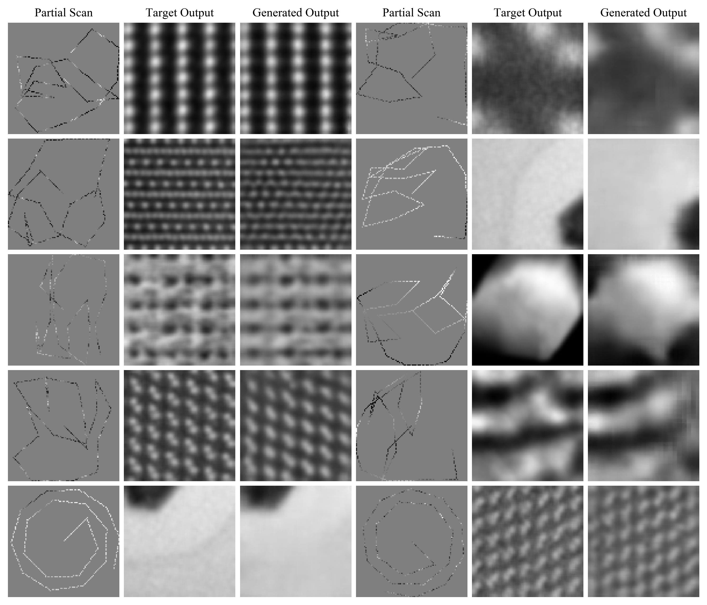

# Adaptive Partial STEM

This repository is for the [preprint](https://arxiv.org/abs/2004.02786)|paper "Adaptive Partial Scanning Transmission Electron Microscopy with Reinforcement Learning". Sparse scans are piecewise adapted to specimens by a recurrent actor that learns to cooperate with a feedforward generator that completes scans.

Supplementary information is [here](https://doi.org/10.5281/zenodo.4304462).

  

Examples show test set 1/23.04 px coverage adaptive partial scans, target outputs and generated partial scan completions for 96x96 crops from STEM images.

## Training

To continue training the neural network; from scratch or to fine-tune it, you will need to adjust some of the variables at the top of `train.py` files. Specifically, variables indicating the location of your training data where to save logs and checkpoints.

Checkpoints for a fully trained model are [here](https://drive.google.com/drive/folders/1CrfIWSdigIsSeo3Sid6PxXuJUvGLk6C6?usp=sharing). They were saved after 500k and 1000k training iterations. To load the models, change the save location in the `checkpoint` file to your save location.

## Training Data

Datasets containing 19769 STEM images cropped or downsampled to 96x96 are [here](https://github.com/Jeffrey-Ede/datasets/wiki). Other dataset variants are also available.

## Miscellaneous

The `misc` folder contains scripts to create graphs in the paper. In addition, `read_loss_log.py` can display loss logs output during training.

## Contact

Jeffrey Ede: j.m.ede@warwick.ac.uk
